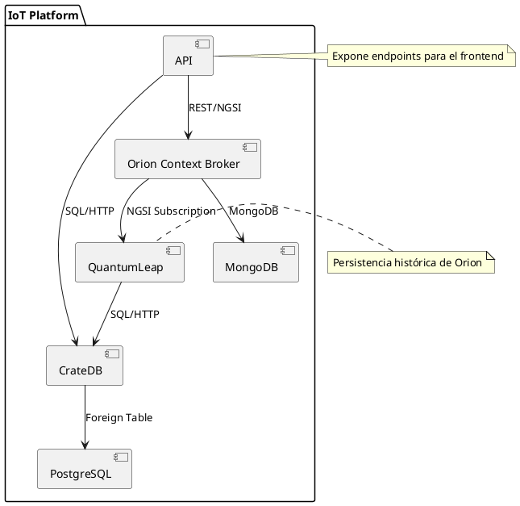

# Plataforma IoT - Backend

## Descripción general

El backend de la plataforma IoT está diseñado para gestionar y almacenar datos provenientes de dispositivos IoT, así como para proporcionar una API RESTful que permita a los clientes interactuar con la plataforma. Cuenta con componente para la gestión de contexto de los dispositivos, almacenamiento de datos históricos y una API para acceder a los datos y funcionalidades de la plataforma.

## Tecnologías utilizadas y arquitectura

- **Orion Context Broker**: Componente de FIWARE para la gestión de contexto en tiempo real.
- **CrateDB**: Base de datos distribuida orientada a columnas, utilizada para almacenar datos de telemetría.
- **QuantumLeap**: Componente que permite la persistencia de datos históricos de Orion en CrateDB.
- **FastAPI**: Framework web moderno y de alto rendimiento para construir APIs con Python 3.7+ basado en estándares como OpenAPI y JSON Schema.
- **Docker**: Contenerización de la aplicación para facilitar su despliegue y gestión.
- **Docker Compose**: Herramienta para definir y gestionar aplicaciones Docker multi-contenedor.
- **Kubernetes**: Orquestación de contenedores para gestionar la escalabilidad y disponibilidad de la aplicación.

La API se comunica con Orion Context Broker para obtener y actualizar el contexto de los dispositivos IoT, y utiliza CrateDB para consultar los datos de telemetría recopilados.

A nivel arquitectónico, la API actúa como un intermediario entre los clientes (aplicaciones web, móviles, etc.) y los componentes de backend (Orion, CrateDB, QuantumLeap), proporcionando una capa de abstracción y facilitando la interacción con la plataforma IoT. La API está diseñada para facilitar su mantenimiento y evolución, permitiendo la adición de nuevas funcionalidades y servicios según sea necesario. Además, la utilización de Docker y Kubernetes permite un despliegue flexible y escalable en diferentes entornos.

La figura siguiente ilustra una arquitectura general básica del backend de la plataforma IoT y la posición de la API dentro de ella. Esta arquitectura aún no cuenta con componentes de ingesta de datos desde dispositivos IoT (por ejemplo, mediante MQTT, CoAP, HTTP, etc.), que se añadirán en futuras iteraciones, así como mecanismos de autenticación y autorización.


> Para visualizar el diagrama en VS Code, usa la extensión PlantUML y configura el servidor:
>
> ```
> "plantuml.server": "https://www.plantuml.com/plantuml"
> ```



## Despliegue del backend

La plataforma IoT puede desplegarse usando Docker Compose y Kubernetes. El despliegue con Docker Compose es adecuado para entornos de desarrollo y pruebas. Para entornos de producción, se recomienda utilizar Kubernetes para una mayor escalabilidad y gestión de los contenedores. A continuación, se describen los pasos para desplegar el backend utilizando Docker Compose.

### Despliegue con Docker Compose

Los servicios de backend se desplegarán desde varios archivos de configuración de Docker Compose, que definen los contenedores necesarios y sus interacciones. Todos estos servicios se ejecutarán en una red Docker llamada `iot-net`. Se cuenta con un script de arranque (`bootstrap.sh`) que automatiza el proceso de despliegue. Este script crea la red `iot-net` si no existe y levanta los servicios definidos en los archivos de configuración. Además, el script configura la persistencia de datos de Orion en CrateDB mediante QuantumLeap y ejecuta un pequeño script de prueba para transferir datos de ejemplo desde Orion a CrateDB.

Para desplegar el backend de la plataforma IoT, sigue estos pasos:

1. Asegúrate de tener Docker y Docker Compose instalados en tu sistema.
2. Navega a la terminal en el directorio raíz del proyecto donde se encuentran los archivos `docker-compose.base.yml` y `docker-compose.api.yml`.
3. Ejecuta el script de arranque:
```bash
./bootstrap.sh
```
4. Espera a que todos los servicios se inicien correctamente. Puedes verificar el estado de los contenedores con:
```bash
docker compose ps
```
5. Para ver los logs de un servicio específico, utiliza:
```bash
docker compose logs <servicio>
```

Después de completar estos pasos, quedan disponibles los siguientes servicios en estos puertos:
| Servicio                  | Puerto Predeterminado | Observaciones          |
|---------------------------|-----------------------|------------------------|
| API RESTful               | 8000                  | Endpoints de la API     |
| CrateDB                   | 4200 (Admin UI)      | Interfaz de administración          |
| Orion Context Broker      | 1026                  | En el futuro no se expondrá          |
| QuantumLeap               | 8668                  | En el futuro no se expondrá          |
| PostgreSQL               | 5432                  | Soporte para CrateDB. En el futuro no se expondrá          |
| MongoDB                  | 27017                 | Soporte para Orion. En el futuro no se expondrá          |

#### Archivos de configuración de Docker Compose

- `docker-compose.base.yml`: Define los servicios principales (CrateDB, Orion, MongoDB, QuantumLeap, PostgreSQL).
- `docker-compose.api.yml`: Define el servicio de API.
- `.env`: Variables de entorno para parametrizar puertos, credenciales y configuraciones.
- `bootstrap.sh`: Script para crear la red Docker y levantar todos los servicios.
- `stop.sh`: Script para detener todos los servicios de la plataforma IoT.
- `api/` (código fuente de la API)

#### Variables de entorno

Configura los parámetros en el archivo `.env`:

```properties
CRATE_HEAP_SIZE=2g
CRATEDB_PORT=5433
ADMIN_UI_PORT=4200
CRATE_HOST=cratedb
CRATE_PORT=4200
LOGLEVEL=INFO
USE_GEOCODING=false
CACHE_QUERIES=true
WQ_MAX_RETRIES=5

POSTGRES_USER=iot_user
POSTGRES_PASSWORD=iot_password
POSTGRES_DB=iot_database

NETWORK_NAME=iot-net
API_PORT=80
```

#### Prueba de la API

Una vez que la plataforma esté desplegada, se puede:

1. Acceder a la API RESTful en `http://localhost`. Dispone de documentación en Swagger UI en `http://localhost/docs`. Consultar el endpoint `GET /dummy` para ver una respuesta con datos de prueba.
2. Acceder a la interfaz de administración de CrateDB en `http://localhost:4200` sin credenciales. Hay disponible una base de datos `mtiot` con una tabla de ejemplo `ettemperaturesensor` que contiene datos de telemetría simulados.
   
### Despliegue con Kubernetes

To Do

## Modelo de datos

El modelo de datos define la estructura y organización de los datos que se manejarán en la plataforma IoT. Los datos a recopilar dependerán de los dispositivos conectados y de los objetivos de la plataforma IoT. Se guardarán datos de contexto/metadatos del dispositivo y datos de telemetría/medición.

### Datos de contexto/metadatos

Los datos de contexto o metadatos proporcionan información sobre los dispositivos y su entorno. Se trata de datos estáticos o semiestaticos que no cambian con frecuencia o de configuración, que describen las características del dispositivo. Algunos ejemplos incluyen:

- **Identificación única:**
    - ID del dispositivo: un identificador único para cada dispositivo en la plataforma (UUID, MAC, etc.)
    - Tipo de dispositivo: sensor, actuador, gateway, PLC, estación IoT, etc.
- **Datos de localización:**
    - Ubicación: Coordenadas GPS (latitud y longitud) del dispositivo.
    - Zona o área: descripción del área geográfica o zona donde se encuentra el dispositivo (almacén, planta, etc.)
- **Características técnicas y de conexión:**
    - Protocolo de comunicación: MQTT, CoAP, HTTP, Modbus, BACnet, LoRaWAN, etc.
    - Credenciales/parámetros de conexión: información necesaria para establecer la comunicación con el dispositivo (dirección IP y puerto del PLC, topic MQTT, ID de dispositivo LoRaWAN, etc.)
    - Capacidad de procesamiento: CPU, memoria, almacenamiento local.
    - Firmware/Software: versión del firmware o software que se está ejecutando en el dispositivo.
    - Estado del dispositivo: información sobre el estado operativo del dispositivo (activo, inactivo, en mantenimiento).
- **Datos administrativos:**
    - Fabricante y modelo: información sobre el fabricante y el modelo del dispositivo (Siemens S7-1200, Arduino Uno, etc.)
    - Fecha de instalación: fecha en que el dispositivo fue instalado.
    - Propietario/Responsable: persona o entidad responsable del dispositivo.
    - Historial de mantenimiento: registros de mantenimiento y reparaciones realizadas en el dispositivo.

#### Particularidades de los metadatos según tipo de dispositivo

Cada tipo de dispositivo tiene unas particularidades de cara al registro de metadatos:

| Dispositivo           | Particularidades                                                                                                                                                                                                                                                                                                                                                   |
|-----------------------|--------------------------------------------------------------------------------------------------------------------------------------------------------------------------------------------------------------------------------------------------------------------------------------------------------------------------------------------------------------------|
| **MQTT**              | **Topic Structure**: Registrar la estructura del topic (p.e. instalacion/salaA/temp/sensor1), el QoS usado y los tipos de datos esperados en cada uno                                                                                                                               |
| **PLCs**              | Dirección IP y Puerto: Dirección IP y puerto del PLC para la comunicación (p.e. `192.168.1.100:502`), método de conexión (p.e. Modbus TCP, OPC UA) y credenciales si aplica, frecuencia de lectura/escritura, registro de Variables (Tags): Mapeo de las direcciones de memoria o "tags" del PLC (p.e. `DB1.DW10`) a nombres significativos en la plataforma (p.e. "Temperatura Caldera"). |
| **LoRaWAN**           | **AppEUI/DevEUI/AppKey**: Registrar los identificadores únicos del dispositivo en la red LoRaWAN (AppEUI, DevEUI) y la clave de aplicación (AppKey) utilizada para la autenticación, así como el servidor de red e id o nombre de la función que decodifica el payload binario de LoRaWAN a datos significativos.                                                  |
| **Orion Context Broker** | **Entity ID y Type**: Registrar el ID único de la entidad y su tipo (p.e. Sensor, Actuator, Gateway) según el modelo de datos NGSI-LD/v2. Además, almacenar los atributos asociados a la entidad y sus metadatos.                                                                                                         |

> **Nota:** Aunque Orion Context Broker no es un dispositivo en sí, sino un componente de gestión de contexto, se incluye aquí por su relevancia en plataformas IoT que utilizan el modelo de datos NGSI para representar y gestionar información sobre dispositivos y sus estados.

### Estructura JSON base de metadatos

Hay una serie de campos comunes que se deben registrar para todos los dispositivos en la plataforma IoT. La tabla siguiente muestra dichos campos, sus tipos de datos, si son obligatorios, una breve descripción y un ejemplo de valor.

| Campo            | Tipo de Dato | Obligatorio | Descripción                                                                 | Ejemplo                                                        |
|------------------|--------------|-------------|-----------------------------------------------------------------------------|----------------------------------------------------------------|
| `id`             | String       | Sí          | Identificador único del dispositivo en la plataforma (UUID)                  | `"550e8400-e29b-41d4-a716-446655440000"`                       |
| `device_id`      | Object       | Sí          | Identificadores específicos del dispositivo según su tipo                    | `{"id_type": "MAC", "id_value": "00:1B:44:11:3A:B7"}`          |
| `name`           | String       | Sí          | Nombre descriptivo del dispositivo                                          | `"Sensor de Temperatura Sala A"`                               |
| `type`           | String       | Sí          | Tipo de dispositivo (sensor, actuador, gateway, PLC, estación IoT, etc.)    | `"sensor"`                                                     |
| `location`       | Object       | No          | Información de localización del dispositivo                                 | `{"latitude": 40.4168, "longitude": -3.7038, "site_area": "Almacén Principal"}` |
| `protocol`       | String       | Sí          | Protocolo de comunicación utilizado por el dispositivo                      | `"MQTT"`                                                       |
| `admin_data`     | Object       | No          | Datos administrativos del dispositivo                                       | `{"manufacturer": "Siemens", "model": "S7-1200", "installation_date": "2023-01-15", "owner": "Juan Pérez", "maintenance_history": []}` |
| `technical_specs`| Object       | No          | Especificaciones técnicas y de conexión del dispositivo                     | `{"firmware_version": "v1.2.3", "ip_address": "192.168.1.100"}`|
| `metatadata`     | Object       | No          | Información específica del dispositivo según su tipo                        | -                                                              |

Hay otra serie de campos específicos que dependen del tipo de dispositivo, como se ha descrito en la sección anterior.

#### Atributos específicos de metadatos para dispositivos MQTT

| Campo            | Tipo de Dato | Obligatorio | Descripción                                                                 | Ejemplo                                 |
|------------------|--------------|-------------|-----------------------------------------------------------------------------|-----------------------------------------|
| `mqtt_topic_root`| String       | Sí          | Raíz del topic MQTT utilizado para el envío/recepción de datos              | `"instalacion/salaA/temp/sensor1"`      |
| `qos`            | Integer      | No          | Nivel de Quality of Service (0, 1, 2) utilizado en la comunicación MQTT     | `1`                                     |
| `data_types`     | Object       | No          | Tipos de datos esperados en los topics (clave: topic, valor: tipo de dato)  | `{"instalacion/salaA/temp": "float"}`   |
| `client_id`      | String       | Sí          | Identificador único del cliente MQTT                                        | `"sensor1"`                             |
| `security`       | Object       | No          | Parámetros de seguridad para la conexión MQTT (usuario/contraseña, TLS, etc.) | `{"type": "TLS"}`                     |

#### Atributos específicos de metadatos para PLCs

| Campo            | Tipo de Dato | Obligatorio | Descripción                                                                 | Ejemplo                                 |
|------------------|--------------|-------------|-----------------------------------------------------------------------------|-----------------------------------------|
| `ip_address`     | String       | Sí          | Dirección IP del PLC para la comunicación                                   | `"192.168.1.100"`                       |
| `port`           | Integer      | Sí          | Puerto de comunicación del PLC                                              | `502`                                   |
| `connection_method`| String     | Sí          | Método de conexión utilizado (Modbus TCP, OPC UA, etc.)                     | `"Modbus TCP"`                          |
| `credentials`    | Object       | No          | Credenciales necesarias para la conexión (usuario/contraseña)               | `{"username": "admin", "password": "password123"}` |
| `read_frequency` | Integer      | No          | Frecuencia de lectura de datos en segundos                                  | `10`                                    |
| `tags_mapping`   | Object       | Sí          | Mapeo de direcciones de memoria o "tags" del PLC a nombres significativos   | `{"DB1.DW10": "Temperatura Caldera"}`   |

#### Atributos específicos de metadatos para dispositivos LoRaWAN

| Campo            | Tipo de Dato | Obligatorio | Descripción                                                                 | Ejemplo                                 |
|------------------|--------------|-------------|-----------------------------------------------------------------------------|-----------------------------------------|
| `appeui`         | String       | Sí          | Identificador único de la aplicación                                        | `"70B3D57ED00001A6"`                    |
| `deveui`         | String       | Sí          | Identificador único del dispositivo                                         | `"0004A30B001C0530"`                    |
| `appkey`         | String       | Sí          | Clave de aplicación utilizada para la autenticación                         | `"8D7F3A2C4B5E6F708192A3B4C5D6E7F8"`    |
| `network_server` | String       | Sí          | Servidor de red LoRaWAN al que está conectado el dispositivo                | `"lora.example.com"`                    |
| `payload_decoder`| String       | Sí          | ID o nombre de la función que decodifica el payload binario de LoRaWAN      | `"decoder_v1"`                          |

### Datos de telemetría/medición

Los datos de telemetría o medición son los datos dinámicos que los dispositivos recopilan y envían a la plataforma IoT. Estos datos reflejan el estado y el comportamiento del entorno monitorizado, y son esenciales para el análisis y la toma de decisiones. Los tipos de datos de telemetría pueden variar según el tipo de dispositivo y la aplicación específica, pero algunos ejemplos comunes incluyen:

- **Valores de sensores:**
    - Medida: el valor numérico o cualitativo registrado por el sensor (p.e. 25.4, "ON", etc.)
    - Unidad de medida: la unidad en la que se expresa la medida (p.e. °C, %, ppm, etc.)
    - Marca de tiempo: la fecha y hora en que se registró la medida.
- **Estado operacional:**
    - Nivel de batería/alimentación: porcentaje de batería restante o estado de la fuente de alimentación.
    - Intensidad de la señal: fuerza de la señal de comunicación (RSSI, SNR, etc.)
    - Códigos de error/alertas: información sobre errores o alertas generadas por el dispositivo.
    - Estado del dispositivo: información sobre el estado operativo del dispositivo (activo, inactivo, en mantenimiento).
    - Salidas de los PLCs: estados de las salidas digitales o analógicas controladas por el PLC (p.e. válvulas abiertas/cerradas, motores encendidos/apagados, etc.)
- **Controles y actuadores:**
    - Valores de consigna: valores establecidos para controlar actuadores (p.e. temperatura objetivo, velocidad del motor, etc.)
    - Comandos recibidos: registros de comandos enviados al dispositivo para controlar su funcionamiento.
    - Respuestas a comandos: confirmaciones o resultados de los comandos ejecutados por el dispositivo.

### Gestión del historial de mantenimiento

Además de los datos de contexto y telemetría, la plataforma almacena información sobre las operaciones de mantenimiento realizadas en los dispositivos. Este historial permite realizar auditorías, planificar mantenimientos preventivos y analizar la vida útil de los componentes.

#### Esquema de base de datos para mantenimiento (PostgreSQL)

Se utilizan dos tablas principales en PostgreSQL para gestionar el historial de mantenimiento:

**Tabla: maintenance_operation_types**

Almacena los tipos de operaciones de mantenimiento predefinidos y extensibles.

| Columna              | Tipo de Dato | Restricciones          | Descripción                                                                 |
|----------------------|--------------|------------------------|-----------------------------------------------------------------------------|
| `id`                 | UUID         | PRIMARY KEY            | Identificador único del tipo de operación                                   |
| `name`               | VARCHAR(100) | UNIQUE, NOT NULL       | Nombre de la operación (ej.: "Calibración", "Reemplazo de Batería")        |
| `description`        | TEXT         | -                      | Descripción detallada de la operación                                       |
| `requires_component` | BOOLEAN      | DEFAULT FALSE          | Indica si la operación requiere especificar un componente afectado          |

Ejemplo DDL:

```sql
CREATE TABLE IF NOT EXISTS maintenance_operation_types (
  id UUID PRIMARY KEY,
  name VARCHAR(100) UNIQUE NOT NULL,
  description TEXT,
  requires_component BOOLEAN DEFAULT FALSE
);
```

**Tabla: maintenance_log**

Tabla de auditoría que registra cada operación de mantenimiento realizada en un dispositivo.

| Columna              | Tipo de Dato | Restricciones          | Descripción                                                                 |
|----------------------|--------------|------------------------|-----------------------------------------------------------------------------|
| `id`                 | UUID         | PRIMARY KEY            | Identificador único del registro de mantenimiento                           |
| `device_id`          | UUID         | FOREIGN KEY, NOT NULL  | Referencia al dispositivo al que se aplica el mantenimiento                 |
| `operation_type_id`  | UUID         | FOREIGN KEY, NOT NULL  | Referencia al tipo de operación realizada                                   |
| `performed_by_id`    | UUID         | FOREIGN KEY            | ID del usuario de Keycloak que realizó la operación                         |
| `start_time`         | TIMESTAMP    | NOT NULL               | Fecha y hora de inicio de la operación                                      |
| `end_time`           | TIMESTAMP    | -                      | Fecha y hora de finalización de la operación (opcional)                     |
| `component_path`     | VARCHAR(255) | -                      | Identificador del componente afectado (ej.: "sensor_temperatura_1")         |
| `details_notes`      | TEXT         | -                      | Notas, observaciones y comentarios del técnico                              |

Ejemplo DDL:

```sql
CREATE TABLE IF NOT EXISTS maintenance_log (
  id UUID PRIMARY KEY,
  device_id UUID NOT NULL REFERENCES devices(id) ON DELETE CASCADE,
  operation_type_id UUID NOT NULL REFERENCES maintenance_operation_types(id),
  performed_by_id UUID REFERENCES users(id),
  start_time TIMESTAMP NOT NULL,
  end_time TIMESTAMP,
  component_path VARCHAR(255),
  details_notes TEXT
);

-- Índices recomendados para optimizar consultas
CREATE INDEX idx_maintenance_log_device_id ON maintenance_log(device_id);
CREATE INDEX idx_maintenance_log_operation_type ON maintenance_log(operation_type_id);
CREATE INDEX idx_maintenance_log_start_time ON maintenance_log(start_time);
```

> **Nota:** Se asume la existencia de las tablas `devices(id)` y `users(id)` (integradas con Keycloak). Las referencias deben ajustarse según el esquema real de la base de datos.

## Especificación de la API RESTful

La API RESTful de la plataforma IoT permite la interacción con los datos y servicios de la plataforma a través de solicitudes HTTP. A continuación, se describen los principales endpoints y sus funcionalidades.

### Endpoints principales

#### Gestión de Dispositivos

- `GET api/v1/devices`  
    _Descripción_: Obtener una lista de todos los dispositivos registrados en la plataforma.  
    _Uso principal_: Carga inicial de dispositivos en la aplicación cliente.

- `POST api/v1/devices`  
    _Descripción_: Registrar un nuevo dispositivo en la plataforma.  
    _Uso principal_: Añadir nuevos dispositivos a la plataforma.

- `GET api/v1/devices/{id}`  
    _Descripción_: Obtener detalles y metadatos de un dispositivo específico.  
    _Uso principal_: Visualizar información detallada de un dispositivo.

- `PUT/PATCH api/v1/devices/{id}`  
    _Descripción_: Actualizar la información y metadatos de un dispositivo.  
    _Uso principal_: Modificar la configuración o información de un dispositivo existente.

#### Gestión de Datos de Telemetría

- `GET api/v1/devices/{id}/telemetry`  
    _Descripción_: Obtener el historial de datos de telemetría para un dispositivo específico (con opciones de filtrado por rango de fechas).  
    _Uso principal_: Visualizar datos históricos o en tiempo real de un dispositivo.

#### Gestión del Historial de Mantenimiento

Los siguientes endpoints permiten registrar y consultar operaciones de mantenimiento realizadas en los dispositivos. Se utiliza una ruta anidada bajo `/devices` para garantizar la asociación con un dispositivo válido.

**Historial de mantenimiento por dispositivo:**

- `POST api/v1/devices/{device_id}/maintenance/log`  
    _Descripción_: Registrar una nueva operación de mantenimiento en un dispositivo específico.  
    _Seguridad_: Requiere rol `maintenance_manager` o `admin`.  
    _Cuerpo de la petición_:
    ```json
    {
      "operation_type_id": "uuid-operation-type",
      "performed_by_id": "uuid-user",
      "start_time": "2025-01-15T10:00:00Z",
      "end_time": "2025-01-15T11:30:00Z",
      "component_path": "sensor_temperatura_1",
      "details_notes": "Cambio de batería y calibración del sensor"
    }
    ```

- `GET api/v1/devices/{device_id}/maintenance/log`  
    _Descripción_: Listar el historial completo de mantenimiento de un dispositivo específico, con opciones de paginación y filtrado por fechas.  
    _Seguridad_: Accesible para roles `viewer`, `operator`, `maintenance_manager` y `admin`.  
    _Parámetros de consulta opcionales_:
    - `from_date`: Fecha de inicio del rango de búsqueda
    - `to_date`: Fecha de fin del rango de búsqueda
    - `page`: Número de página para paginación
    - `page_size`: Tamaño de página

**Gestión de registros individuales:**

- `PATCH api/v1/maintenance/log/{log_id}`  
    _Descripción_: Actualizar un registro de mantenimiento existente (por ejemplo, añadir `end_time` o notas adicionales).  
    _Seguridad_: Requiere rol `maintenance_manager` o `admin`.

- `DELETE api/v1/maintenance/log/{log_id}`  
    _Descripción_: Eliminar un registro del historial de mantenimiento (requiere alta autorización).  
    _Seguridad_: Requiere rol `admin`.

**Tipos de operación de mantenimiento:**

- `GET api/v1/maintenance/operation-types`  
    _Descripción_: Obtener la lista completa de tipos de operación de mantenimiento disponibles. Útil para rellenar formularios y validar datos.  
    _Seguridad_: Accesible para roles `viewer`, `operator`, `maintenance_manager` y `admin`.

Opcionalmente, se pueden implementar endpoints administrativos adicionales para gestionar los tipos de operación:

- `POST api/v1/maintenance/operation-types` (roles: `admin`, `maintenance_manager`)
- `PATCH api/v1/maintenance/operation-types/{id}` (roles: `admin`, `maintenance_manager`)
- `DELETE api/v1/maintenance/operation-types/{id}` (rol: `admin`)

#### Estado

- `GET api/v1/devices/{id}/state`  
    _Descripción_: Obtener el estado operativo actual del dispositivo (temperatura, nivel de batería, señales de error, etc.).  
    _Uso principal_: Monitorizar el estado en tiempo real del dispositivo.

