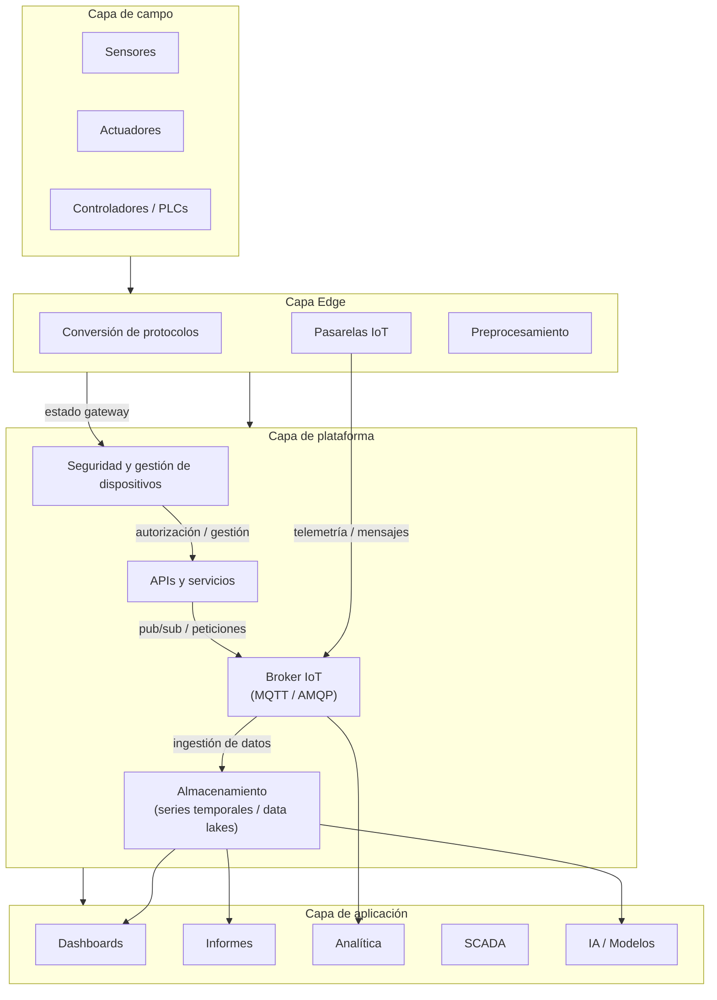

# CROPDATASPACE - La necesidad de una plataforma IoT

**Origen:** conversión textual de la presentación `CROPDATASPACE Necesidad Plataforma IoT.pptx`.

**Nota de conversión:** el contenido textual se ha transcrito desde las diapositivas. Las imágenes, iconos y diagramas se han descrito y, cuando contenían información relevante, se han transformado a texto estructurado. Los logotipos y elementos de pie/cabecera se describen solo cuando aportan contexto.

---

## Diapositiva 4 - Contexto en ARM

### Texto extraído

- Gran cantidad de proyectos: IoF, SABANA, CALRESI, Cybergreen, Agroconnect, LIFE-ACCLIMATE, Agritech UE, CSR, CROP, etc.
  - Gran cantidad de sistemas dispersos.
  - Equipos heterogéneos: sensores, estaciones, PLCs, SCADA, controladores locales, etc.
  - Uso de protocolos diferentes: Modbus, OPC-UA, MQTT, HTTP, LoRaWAN, etc.
  - Dificultad para integrar datos y coordinar acciones entre sistemas.
  - Falta de una visión unificada / gestión centralizada.

---

## Diapositiva 5 - Problemas detectados

### Texto extraído

1. **Fragmentación tecnológica**
   - Alto coste de mantenimiento e integración.

2. **Datos dispersos**
   - Difícil correlacionar información entre proyectos.

3. **Falta de normalización**
   - Incompatibilidades entre fabricantes y proyectos/sistemas.

4. **Dificultad para análisis**
   - Dificultad de acceso a datos históricos.

5. **Seguridad débil**
   - Políticas diferentes en cada subsistema.

---

## Diapositiva 6 - Oportunidad: Plataforma IoT

### Texto extraído

1. **Centralización**
   - Adquisición, mantenimiento y gestión de los datos.

2. **Interoperabilidad**
   - Dispositivos y protocolos.

3. **Capa común de servicios**
   - Autenticación, monitorización, alarmas, analítica.

4. **Nivel de decisión**
   - Control y analítica sobre datos unificados.

5. **Bases**
   - Automatización inteligente, gemelos digitales, modelos predictivos.

### Imágenes y elementos visuales

La diapositiva usa cinco iconos alineados horizontalmente para presentar la oportunidad de una plataforma IoT:

- Centralización: engranaje o símbolo de coordinación, asociado a gestión unificada.
- Interoperabilidad: nodos y engranajes conectados, indicando integración entre sistemas.
- Capa común de servicios: círculos superpuestos, que simbolizan servicios compartidos.
- Nivel de decisión: lupa con elementos tecnológicos, asociada a análisis y toma de decisiones.
- Bases: figura tipo robot/automatización junto a datos, que apunta a IA, modelos predictivos y gemelos digitales.

La secuencia visual transforma los problemas de la diapositiva anterior en capacidades deseadas de la plataforma.

---

## Diapositiva 7 - Arquitectura plataforma IoT

### Texto extraído de la imagen / diagrama

El diagrama representa una arquitectura por capas:

### Capa de campo

Elementos físicos o de instalación:

- Sensores.
- Actuadores.
- Controladores / PLCs.

### Capa Edge

Elementos cercanos al campo, encargados de adaptación local:

- Conversión de protocolos.
- Pasarelas IoT.
- Preprocesamiento.

Flujos indicados:

- Desde la capa de campo hacia la capa Edge.
- Desde pasarelas IoT hacia el broker mediante **telemetría / mensajes**.
- Información de **estado gateway** hacia seguridad y gestión de dispositivos.

### Capa de plataforma

Servicios centrales:

- Seguridad y gestión de dispositivos.
- APIs y servicios.
- Broker IoT, con protocolos MQTT / AMQP.
- Almacenamiento, incluyendo series temporales y data lakes.

Flujos internos indicados:

- Seguridad y gestión de dispositivos se conecta con APIs y servicios mediante **autorización / gestión**.
- APIs y servicios se conectan con el broker IoT mediante **pub/sub / peticiones**.
- Broker IoT se conecta con almacenamiento mediante **ingestión de datos**.

### Capa de aplicación

Herramientas y aplicaciones finales:

- Dashboards.
- Informes.
- Analítica.
- SCADA.
- IA / Modelos.

### Tecnologías listadas en el lateral del diagrama

**Aplicación / visualización / análisis:**

- Apache Superset.
- Grafana.
- FUXA.
- H2O.
- JupyterHub.

**Plataforma / servicios centrales:**

- Keycloak.
- FIWARE, incluyendo OCB y QuantumLeap.
- Mosquitto / Kafka.
- MinIO.
- CrateDB.
- Apache Airflow.
- Apache NiFi.
- ThingsBoard.

**Edge / integración local:**

- Conversores ad-hoc.
- Node-RED.

### Representación textual aproximada del diagrama

### Interpretación textual

La arquitectura separa claramente cuatro niveles: campo, edge, plataforma y aplicación. El objetivo es aislar la heterogeneidad de dispositivos y protocolos en la capa Edge, centralizar servicios comunes en la plataforma y ofrecer herramientas de visualización, control, analítica e inteligencia artificial en la capa de aplicación.

---

## Diapositiva 8 - Beneficios esperados

### Texto extraído

1. **Integración**
   - Sistemas en una arquitectura común.

2. **Reutilización**
   - Desarrollos y datos de proyectos anteriores.

3. **Ahorro**
   - Reducción de costes y tiempos de integración de nuevos proyectos.

4. **Escalabilidad**
   - Nuevos dispositivos e instalaciones.

5. **Confiabilidad**
   - Mejora el acceso y la seguridad a los datos.

