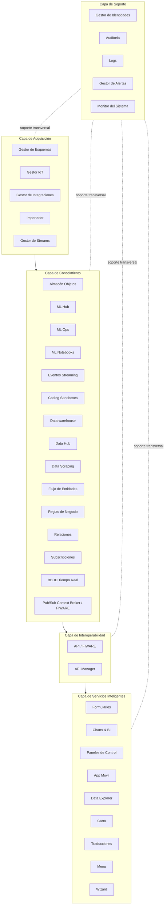
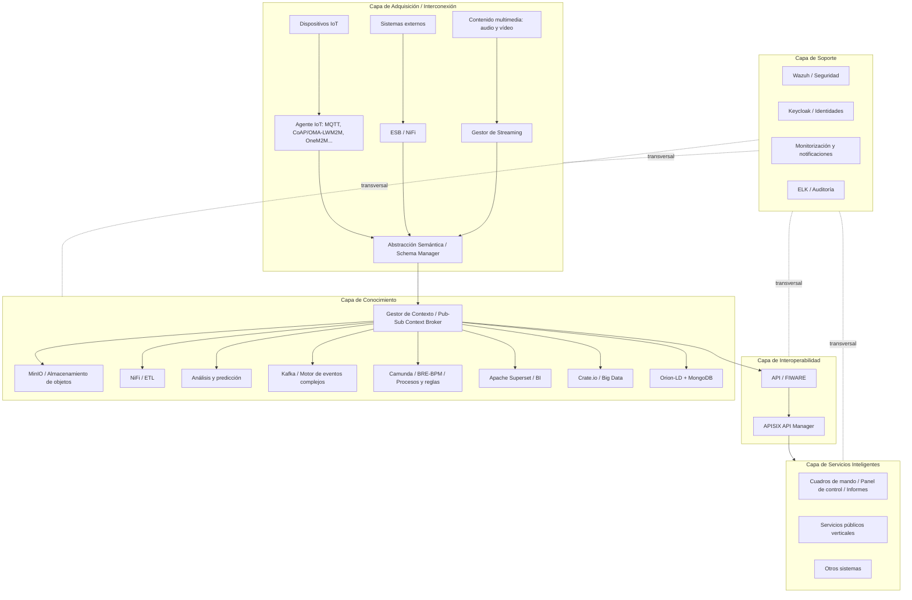

# Plataforma IoT CCOC de NEC

---

## 2. Plataforma CCOC NEC

**CCOC:** Cloud City Operations Center.

- Certificación **Powered by FIWARE**:
  - Diseño.
  - Arquitectura.
  - Protocolos.
  - Mejores prácticas.
- Enfoque modular, multivertical y basado en software de código abierto.
- Soporte multiproyecto.
- Certificación **ENS en nivel medio**:
  - Obligatoria para organismos públicos y sus proveedores cuando manejen datos o servicios sensibles.
  - No orientada a datos o servicios críticos.

---

## 3. Arquitectura funcional

### Stack funcional por capas

La arquitectura se organiza como un stack horizontal de cuatro capas principales y una columna lateral de soporte. La lectura funcional va de abajo hacia arriba: adquisición → conocimiento/contexto → interoperabilidad/API → servicios inteligentes. La columna de soporte queda conectada transversalmente al conjunto.

### Capa de adquisición

Bloque inferior de la arquitectura. Agrupa los elementos de entrada, adaptación e integración de datos.

- **Gestor de Esquemas**
  - Barra superior dentro de la capa de adquisición.
  - Icono de compás/dibujo técnico.
  - Función asociada: normalización semántica y estructural de los datos antes de integrarlos.

- **Gestor IoT**
  - Caja inferior izquierda.
  - Icono de nube/dispositivo.
  - Entrada de datos procedentes de dispositivos IoT.

- **Gestor de Integraciones**
  - Caja inferior central izquierda.
  - Icono de embudo o conector.
  - Integración de fuentes y tecnologías heterogéneas.

- **Importador**
  - Caja inferior central derecha.
  - Icono de bandeja con flecha ascendente.
  - Importación de datos desde fuentes externas o cargas puntuales.

- **Gestor de Streams**
  - Caja inferior derecha.
  - Icono de cámara/sensor orientado a flujo continuo.
  - Entrada de datos en streaming.

### Capa de conocimiento

Bloque central de mayor densidad funcional. Concentra contexto, datos, reglas, analítica y almacenamiento.

- **Pub/Sub Context Broker**
  - Barra horizontal inferior de la capa de conocimiento.
  - Marcado con logotipo **FIWARE**.
  - Núcleo de publicación/suscripción para el contexto.

- **Almacén Objetos**
  - Caja superior izquierda.
  - Icono de carpetas/almacenamiento.
  - Almacenamiento de objetos o ficheros.

- **ML Hub**
  - Caja superior, segunda posición.
  - Icono de red/modelo.
  - Espacio para recursos de machine learning.

- **ML Ops**
  - Caja superior, tercera posición.
  - Icono de cubo/paquete.
  - Operación y ciclo de vida de modelos ML.

- **ML Notebooks**
  - Caja superior, cuarta posición.
  - Icono de lápiz.
  - Cuadernos de trabajo analítico, experimentación y ciencia de datos.

- **Eventos Streaming**
  - Caja superior, quinta posición.
  - Icono de persona junto a elementos de evento.
  - Tratamiento de eventos en tiempo real.

- **Coding Sandboxes**
  - Caja superior, sexta posición.
  - Icono de ventana con código.
  - Entornos aislados de desarrollo o pruebas.

- **Data warehouse**
  - Caja grande en la derecha superior.
  - Icono de bases de datos enlazadas.
  - Almacenamiento analítico estructurado.

- **Data Hub**
  - Caja inferior izquierda.
  - Icono de base de datos con símbolo de suma.
  - Concentrador de datos.

- **Data Scraping**
  - Caja inferior, segunda posición.
  - Icono de embudo.
  - Captura o extracción de datos desde fuentes no integradas directamente.

- **Flujo de Entidades**
  - Caja inferior, tercera posición.
  - Icono de árbol jerárquico.
  - Flujo/encadenado de entidades de contexto.

- **Reglas de Negocio**
  - Caja inferior, cuarta posición.
  - Icono de piezas o nodos.
  - Modelado de reglas y lógica de negocio.

- **Relaciones**
  - Caja inferior, quinta posición.
  - Icono de bloques conectados.
  - Relaciones entre entidades, objetos o datos de contexto.

- **Suscripciones**
  - Caja inferior, sexta posición.
  - Icono de campana.
  - Subscripciones/notificaciones asociadas a cambios de contexto.

- **BBDD Tiempo Real**
  - Caja grande en la derecha inferior.
  - Icono de base de datos con marcador temporal.
  - Persistencia de información en tiempo real.

### Capa de interoperabilidad

Bloque situado sobre la capa de conocimiento.

- **API**
  - Barra horizontal principal.
  - Marcada con logotipo **FIWARE**.
  - Punto de exposición común para consumir capacidades de la plataforma.

- **Manager / API Manager**
  - Caja a la derecha de la barra API.
  - Icono de nube con texto API.
  - Gestión, publicación y control de APIs.

### Capa de servicios inteligentes

Bloque superior del stack. Representa las aplicaciones y servicios orientados al usuario o a verticales concretas.

- **Formularios**
  - Icono de mano/documento.
  - Captura manual o estructurada de información.

- **Charts & BI**
  - Icono de gráfica ascendente.
  - Visualización analítica e inteligencia de negocio.

- **Paneles de Control**
  - Icono de monitor con panel.
  - Dashboards operativos.

- **App Móvil**
  - Icono de teléfono.
  - Acceso móvil a funcionalidades o datos.

- **Data Explorer**
  - Icono de cadena/enlace.
  - Exploración y consulta de datos.

- **Carto**
  - Icono de mapa/localización.
  - Visualización geográfica/cartográfica.

- **Traducciones**
  - Icono de globos de conversación.
  - Servicios de traducción o localización lingüística.

- **Menu**
  - Icono de cuadrícula de aplicaciones.
  - Acceso organizado a módulos o herramientas.

- **Wizard**
  - Icono de varita mágica.
  - Asistentes guiados para configuración o uso.

### Capa de soporte

Columna lateral izquierda. Se representa como un conjunto de servicios transversales que acompañan a las capas principales.

- **Gestor de Identidades**
  - Icono de usuarios.
  - Gestión de autenticación, usuarios y permisos.

- **Auditoría**
  - Icono de escudo.
  - Trazabilidad y control de acciones.

- **Logs**
  - Icono de documento con etiqueta “LOG”.
  - Registro de actividad técnica y operativa.

- **Gestor de Alertas**
  - Icono de monitor con triángulo de advertencia.
  - Alertas sobre estados, incidencias o eventos relevantes.

- **Monitor del Sistema**
  - Icono de servidor/monitorización.
  - Supervisión del estado general de la plataforma.

### Arquitectura funcional en texto estructurado



---

## 4. Descripción de las capas

### Capa de adquisición

- Variedad en origen, tipo y volumen de datos y tecnologías asociadas.
- Transformación a formato único **OMA NGSI** propuesto por FIWARE → interoperabilidad.
- Gestor de integraciones.
- Gestor de esquemas para favorecer la integración.

### Capa de conocimiento

- Gestor de contextos.
- Almacenamiento adaptado a la situación.
- Gestores de reglas y procesos de negocio.
- Herramientas ETL.
- BI con módulos ML y cuadernos Jupyter.
- Gestor de eventos complejos.
- Visualización geográfica.

---

## 5. Descripción de las capas

### Capa de interoperabilidad

- API.
- Gestor de APIs.

### Capa de soporte

- Gestor de identidades.
- Auditoría.

### Capa de servicios inteligentes

- Capa superior orientada a aplicaciones, visualización, formularios, paneles, herramientas BI, apps, exploración de datos y servicios verticales.

---

## 6. Tecnología utilizada

### Stack tecnológico por capas

El esquema sustituye las cajas funcionales de la arquitectura por tecnologías concretas. Mantiene la misma lógica vertical: adquisición/interconexión en la base, conocimiento en el centro, interoperabilidad mediante API y servicios inteligentes en la parte superior. La capa de soporte queda como columna transversal a la izquierda.

### Capa de adquisición / interconexión

Bloque inferior del stack tecnológico.

- **Abstracción Semántica / Schema Manager**
  - Barra horizontal superior dentro de la capa.
  - Función asociada: normalizar semánticamente los datos antes de subirlos hacia contexto/conocimiento.

- **Agente IoT**
  - Caja inferior izquierda.
  - Protocolos indicados:
    - MQTT.
    - CoAP / OMA-LWM2M.
    - OneM2M.
    - Otros protocolos IoT.

- **ESB — NiFi**
  - Caja inferior central.
  - Componente de bus de integración / flujo de datos.
  - NiFi aparece como tecnología para orquestar movimiento, transformación e integración de datos.

- **Gestor de Streaming**
  - Caja inferior derecha.
  - Gestión de flujos de datos continuos.

- **Dispositivos IoT**
  - Caja bajo Agente IoT.
  - Origen físico/operativo de los datos.

- **Sistemas Externos**
  - Caja bajo ESB.
  - Fuentes o plataformas ajenas conectadas a CCOC.

- **Contenido Multimedia — Audio y Vídeo**
  - Caja bajo Gestor de Streaming.
  - Entrada de datos no tabulares, especialmente multimedia.

**Relación funcional del bloque:**

```text
Dispositivos IoT + Sistemas Externos + Contenido Multimedia
        ↓
Agente IoT / ESB-NiFi / Gestor de Streaming
        ↓
Abstracción Semántica — Schema Manager
```

### Capa de conocimiento

Bloque central del stack tecnológico.

- **MinIO — Almacenamiento de Objetos**
  - Caja superior izquierda.
  - Repositorio de objetos/ficheros.

- **NiFi — ETL**
  - Caja superior central izquierda.
  - Procesos ETL: extracción, transformación y carga.

- **Análisis y Predicción**
  - Caja superior central derecha.
  - Icono de red neuronal/nodos.
  - Módulo analítico/predictivo.

- **Kafka — Motor de Eventos Complejos**
  - Caja inferior izquierda.
  - Procesamiento de eventos y flujos.

- **Camunda — BRE/BPM, Procesos y Reglas de Negocio**
  - Caja inferior central.
  - Motor de reglas, procesos de negocio y automatización BPM.

- **Apache Superset — Business Intelligence (BI)**
  - Caja inferior central derecha.
  - Cuadros de mando, reporting y analítica BI.

- **Crate.io — Repositorio Big Data**
  - Cilindro grande a la derecha.
  - Almacenamiento masivo/big data.

- **Gestor de Contexto — Pub/Sub Context Broker**
  - Barra horizontal inferior de la capa de conocimiento.
  - Núcleo contextual de la plataforma.
  - Tecnologías indicadas a la derecha:
    - **Orion-LD**.
    - **MongoDB**.

**Relación funcional del bloque:**

```text
Schema Manager
      ↓
Gestor de Contexto — Pub/Sub Context Broker
      ├─ Orion-LD + MongoDB
      ├─ Crate.io para Big Data
      ├─ MinIO para objetos
      ├─ Kafka para eventos complejos
      ├─ Camunda para procesos/reglas
      ├─ NiFi para ETL
      ├─ Superset para BI
      └─ Análisis y Predicción
```

### Capa de interoperabilidad

Bloque situado sobre la capa de conocimiento.

- **API — FIWARE**
  - Barra horizontal principal.
  - FIWARE aparece como referencia de interoperabilidad.

- **APISIX — API Manager**
  - Caja a la derecha.
  - Gestión y exposición de APIs.

**Relación funcional:**

```text
Gestor de Contexto / servicios de conocimiento
        ↓
API FIWARE
        ↓
APISIX API Manager
```

### Capa de servicios inteligentes

Bloque superior del stack.

- **Cuadros de Mando, Panel de Control, Informes, etc.**
  - Caja superior izquierda.
  - Icono de monitor con panel.
  - Consumo de datos para visualización, operación y reporting.

- **Servicios Públicos Verticales**
  - Caja superior central.
  - Icono de panel con indicadores.
  - Servicios específicos por vertical o dominio.

- **Otros Sistemas**
  - Caja superior derecha.
  - Integración o consumo por aplicaciones externas.

**Relación funcional:**

```text
API / API Manager
      ↓
Dashboards + Paneles + Informes
Servicios verticales
Otros sistemas consumidores
```

### Capa de soporte

Columna lateral izquierda del esquema tecnológico.

- **Wazuh — Seguridad**
  - Caja superior de soporte.
  - Seguridad, detección, monitorización y cumplimiento.

- **Keycloak — Servidor de Identidades**
  - Segunda caja.
  - Gestión de identidad, autenticación y autorización.

- **Monitorización y Notificaciones**
  - Tercera caja.
  - Seguimiento operativo y avisos.

- **ELK — Auditoría**
  - Caja inferior.
  - Stack Elasticsearch / Logstash / Kibana para logs, trazabilidad y auditoría.

### Stack tecnológico en texto estructurado



---
